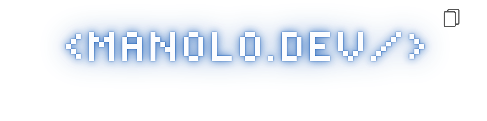

<h1 align="center">Hi 👋, I'm <a href="https://github.com/Nolos17" target="blank">
Manolo Dev</a></h1>
<p align="center">
  <a href="https://github.com/DenverCoder1/readme-typing-svg">
    
  </a>
</p>

## <picture></picture> About me

```typescript
const Manolo = {
  name: "Manolo Torres",
  role: "Soon-to-be Information Technology Engineer @Ecuador",
  focus: "Full Stack Development | Data Analysis |  ",
  experience: {
    academic: true,
    projects: ["Web apps", "Data analysis", "APIs" ],
    openSource: true
  },
};

```

## 🚀 My Skills

### 🧠 Programming Languages
<p align="center"> <a href="https://skillicons.dev">  </a> </p>

### 🌐 Web Development

#### Frontend

<p align="center">  </p>

#### Backend

<p align="center">  </p>

### 📊 Data & Business Intelligence
<p align="center">  </p>

### ☁️ Cloud & DevOps
<p align="center">  </p>

### 🛠️ Tools & Version Control
<p align="center">  </p>

### 🌐 Networking & Systems
<p align="center">  </p>


## Connect with me 🤝
<p align="center">

 <div align="center"  class="icons-social" style="margin-left: 10px;">
        <a style="margin-left: 10px;"  target="_blank" href="https://www.linkedin.com/in/manolo-torres19/">
			</a>
        <a style="margin-left: 10px;" target="_blank" href="https://github.com/Nolos17">
		</a>
	   <a style="margin-left: 10px;" target="_blank" href="https://instagram.com">
			</a>
		<a style="margin-left: 10px;" target="_blank" href="https://twitter.com">
			</a>
		<a style="margin-left: 10px;" target="_blank" href="https://www.youtube.com">
				</a>
      </div>
</p> 

    

